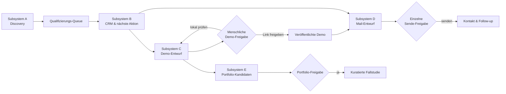

# LeadGen — Vollausbau im GSD-Verfahren (Master-Roadmap)

> **For agentic workers:** REQUIRED SUB-SKILL: Dies ist ein **Orchestrierungs-/Roadmap-Plan über mehrere Wellen**, kein einzelner Task-Plan. Der Hauptagent arbeitet als GSD-Orchestrator (Rolle: [`.claude/agents/gsd-orchestrator.md`](../../../.claude/agents/gsd-orchestrator.md)). Führe **eine Welle nach der anderen** aus; erst bei grünem Gate startet die nächste. Für die produktive Umsetzung einer Welle gilt `superpowers:subagent-driven-development`. Jede Welle bekommt ein eigenes Statusdokument unter `docs/superpowers/status/<welle>.md`.

**Goal:** Aus einem klar passenden Hamburger Betrieb einen verifizierbaren Befund, eine geprüfte Demo, ein individuelles Anschreiben und ein verwertbares Portfolio-Muster erzeugen — vollständig lokal kontrolliert, mit menschlicher Einzelfreigabe vor jeder Außenwirkung.

**Architecture:** Bestehende Trennung bleibt: Python-Backend (JSON-API + CLIs), statisches Cockpit, dateibasierte Artefakte (Markdown/YAML/JSON, Slug als Klammer). Ergänzt werden nur: eine kanonische Demo-Zustandsmaschine (Abschnitt 2.1), eine kleine Qualifizierungs-Queue, beweisbare Qualitätsgates und ein kuratiertes Portfolio-Manifest. Kein Datenbankwechsel, kein Scheduler, kein generischer Site-Builder.

**Tech Stack:** Python 3.12 stdlib, Vanilla JS/HTML/CSS (kein Build-Step), pytest; Git-Push und SMTP werden in Tests injiziert/gefälscht.

**Kriterien-Anker:** Pro Welle ein Gate (Abschnitt 4), verpflichtende Gates vor jeder Integration (Abschnitt 5.1), Definition of Done (Abschnitt 9). Keine Welle gilt als fertig ohne echte Testausgabe und — bei Cockpit-Änderungen — Stakeholder-Prüfung.

---

## 1. Ausgangspunkt und verbindliche Zielgrenzen

Das Repository besitzt bereits einen stabilen Kern: Discovery kann Kandidaten recherchieren und bewerten, das dateibasierte CRM führt kalte und warme Leads, das Cockpit stellt die Daten dar, und für Prototypen sowie Outreach existieren Backend-Zustandsflüsse. Der aktuelle Datenbestand zeigt jedoch, dass die operative Engstelle nicht eine größere Lead-Menge ist: In der Pipeline stehen viele Leads im frühen Status, während bislang nur ein Beispiel-Prototyp vorliegt und kein aufgebautes Portfolio existiert.

Die ersten Ausbauschritte sollen daher **nicht** zu einer breitflächigeren Discovery, einem Datenbankwechsel, Serienmails, Tracking-Pixeln, einem komplexen Scheduler oder einem generischen Website-Builder führen. Diese Punkte würden Komplexität schaffen, ohne den Kernnachweis zu liefern: Kann das System aus einem klar passenden Betrieb einen verifizierbaren Befund, eine gute Demo, ein sauberes Anschreiben und ein verwertbares Lernergebnis erzeugen?

| Dimension | Verbindliche Entscheidung für den Ausbau | Bewusst ausgeschlossen, bis der Pilot funktioniert |
|---|---|---|
| Zielmarkt | Ein Segment und ein lokaler Bereich pro Pilotwelle | Parallele Expansion über viele Branchen und Stadtteile |
| CRM | Weiterhin Markdown, YAML und JSON; CLI bleibt die schreibende Instanz | Datenbank, Mehrbenutzerrechte, umfangreiche Integrationen |
| Prototypen | Individuelle, self-contained One-Pager mit Prüf- und Freigabestatus | Automatische Massenproduktion, ein generischer Landing-Page-Baukasten |
| Veröffentlichung | Zuerst lokal prüfbar; öffentlich erst nach individueller Freigabe | Automatisches Live-Schalten jedes erzeugten Entwurfs |
| Outreach | Einzelentwurf, Vorschau und Einzelbestätigung bleiben Pflicht | Serienversand, automatische Follow-up-Sequenzen, automatisierte Empfängerrecherche |
| Portfolio | Kuratierte, separat freigegebene Fallstudien aus starken Demos | Ein öffentliches Archiv aller Lead-Demos |

Die bestehenden Grundlagen liegen in [README.md](../../../README.md), [CLAUDE.md](../../../CLAUDE.md), den Spezifikationen in [`docs/superpowers/specs/`](../specs/) sowie den bereits angelegten Agenten unter [`.claude/agents/`](../../../.claude/agents/).

---

## 2. Zielarchitektur nach dem Vollausbau

Das Ziel ist kein neuer Monolith. Die bestehende Trennung zwischen Python-Backend, statischem Cockpit und dateibasierten Artefakten bleibt erhalten. Ergänzt werden nur eine klare Zustandsmaschine für Demos, eine kleine Entscheidungswarteschlange, ein beweisbarer Qualitätsprozess und ein kuratiertes Portfolio-Manifest.



| Subsystem | Verantwortlicher Output | Verbindliche Eingabe | Nächster Übergabepunkt |
|---|---|---|---|
| A — Discovery | Kandidat mit Quellen, überprüfbarem Befund, Score und Triage-Status | Segment, Stadtteil, öffentlich verfügbare Geschäftsdaten | Qualifizierungs-Queue in B |
| B — Tracking | Ein eindeutiger Lead mit Status, nächster Aktion und Historie | Kandidat oder manueller Lead | C, D oder Wiedervorlage |
| C — Prototyp | Prüffähiger lokaler Demo-Entwurf; optional freigegebener Link | Konkrete Schwäche, erlaubte Fakten, CTA und Stilbriefing | D oder E |
| D — Outreach | Individueller E-Mail-Entwurf und eine explizit freigegebene Versandaktion | Warmer Lead, E-Mail, Angebot, Nutzen, optionaler Demo-Link | B: Kontakt-/Follow-up-Historie |
| E — Portfolio | Kuratierte, freigegebene Fallstudie oder anonymisiertes Muster | Ein nachweislich starker Prototyp und dokumentierte Erkenntnis | Portfolio-Ansicht bzw. Referenzmaterial |

### 2.1 Kanonische Daten- und Statusregeln

Der **Slug** bleibt die eindeutige Klammer zwischen Discovery-Run, Pipeline-Zeile, warmer Lead-Datei, Prototyp-Zustand, Demo-Ordner und späterem Portfolio-Manifest. Der Hauptagent darf keine dieser Datenquellen direkt editieren, wenn bereits eine CLI- oder API-Operation existiert. Das schützt die Tabellenstruktur, YAML-Frontmatter und Graduierung.

Für Subsystem C wird der aktuell uneinheitliche Ablauf vereinheitlicht. Im Cockpit existiert derzeit ein manueller „Design-Prompt kopieren"-Weg, während Backend und ältere Planung einen Auftrag-zu-Deploy-Weg vorsehen. Der Ausbau führt deshalb einen eindeutigen, testbaren Demo-Lebenszyklus ein.

| Demo-Status | Bedeutung | Zulässige Aktion | Menschliche Entscheidung erforderlich |
|---|---|---|---|
| `none` | Noch keine Demo angefordert | Auftrag anlegen | Nein |
| `pending` | Kontext ist vollständig; der Entwurf wird erstellt | Entwurf zurückgeben oder abbrechen | Nein |
| `draft_ready` | HTML liegt lokal vor und ist prüfbar | Vorschau, Qualitätstest, überarbeiten | Nein |
| `approved_local` | Inhaltlich und visuell für den internen Einsatz freigegeben | lokal zeigen oder für Link freigeben | Ja |
| `published` | Freigegebene Demo hat eine öffentliche URL | Link in Outreach vorbefüllen | Ja, vor dem ersten Veröffentlichen |
| `rework` | Entwurf braucht eine Korrektur | neuen Entwurf anfordern | Nein |
| `archived` | Demo wird nicht weiterverwendet | optional als Lernartefakt behalten | Ja |

Der frühere Status `ready` wird nur noch als Migrationswert akzeptiert und in `draft_ready` oder `published` überführt. Damit ist im Cockpit für jeden Lead sichtbar, ob die Demo lediglich erstellt, intern freigegeben oder tatsächlich öffentlich geteilt wurde.

---

## 3. GSD-Betriebsmodell mit mehreren Agenten

### 3.1 Orchestrierungsregeln

Der Hauptagent arbeitet als **GSD-Orchestrator**. Er zerlegt eine Welle in kleine, vertikal prüfbare Arbeitspakete, weist jedem Paket eine eindeutige Dateigrenze zu, sammelt die Berichte ein und integriert erst nach einem Qualitätsgate. Fachagenten dürfen nur innerhalb ihres Auftrags arbeiten; sie starten keine Folgearbeiten aus eigener Initiative und treffen keine Veröffentlichungs- oder Versandentscheidungen.

Jede GSD-Welle folgt derselben Reihenfolge: **Orientieren → Vertrag festlegen → umsetzen → prüfen → integrieren → Pilot lernen**. Der Orchestrator darf höchstens drei spezialisierte Agenten gleichzeitig einsetzen. Parallele Agenten dürfen nicht dieselben Produktionsdateien ändern. Wenn ein Paket Änderungen an `backend/app.py` und `frontend/app.js` gleichzeitig benötigt, erhält ein einzelner Integrationsagent den Auftrag; alle anderen liefern davor ausschließlich Spezifikation, Tests oder Review-Berichte.

| Regel | Umsetzung |
|---|---|
| Eine Wahrheit pro Entscheidung | Der Orchestrator schreibt bestätigte Entscheidungen in den Wellen-Plan, nicht nur in Chat-Notizen. |
| Ein Eigentümer pro Datei | Pro Welle ist je Datei genau ein schreibender Agent benannt. |
| Erst Tests, dann Merge | Jeder Implementierungsauftrag beginnt mit einem reproduzierbaren fehlenden oder anzupassenden Test und endet mit dem echten Testprotokoll. |
| Keine stillen Außenwirkungen | Kein Agent sendet E-Mails, pusht in ein öffentliches Demo-Repository oder ändert Zugangsdaten. Diese Schritte benötigen eine separate, explizite menschliche Freigabe. |
| Kleine Commits | Jeder Commit enthält nur ein zusammenhängendes Verhalten und die dazugehörigen Tests/Dokumentation. |
| Berichte sind Artefakte | Jeder Agent übergibt Scope, geänderte Dateien, Tests, Risiken und offene Entscheidungen in einem standardisierten Ergebnis. |

### 3.2 Agentenkarte

Die bestehenden Rollen `lead-anlegen`, `code-qualitaet` und `stakeholder-tester` werden beibehalten. Ergänzt werden spezialisierte, schmal geschnittene Agenten. Die folgenden Dateien sind in **Welle 0** anzulegen; die Beschreibungen sind bewusst so gefasst, dass der Hauptagent sie direkt als Subagent-Aufträge verwenden kann.

| Agent | Typ | Schreibbereich | Aufgabe und Lieferobjekt |
|---|---|---|---|
| `gsd-orchestrator` | koordinierend | Plan-, Status- und Integrationsdokumente; bei Integrationspaketen klar benannte Dateien | Plant Wellen, vergibt Pakete, prüft Übergaben, führt nur freigegebene Änderungen zusammen. |
| `discovery-auditor` | read-only | keiner | Prüft Run-Dateien, Segmentabdeckung, Evidenzqualität und Triage-Engpässe. Liefert eine priorisierte Liste, keinen Code. |
| `discovery-engineer` | implementierend | `backend/discotool.py`, `backend/discover.py`, zugehörige Tests | Baut deterministische Discovery-Verbesserungen; verändert nicht CRM oder Cockpit. |
| `pipeline-operator` | bestehend: `lead-anlegen` | keine direkte Dateieditierung; nur CLI | Führt kontrollierte Pilotbewegungen im CRM aus und berichtet alle geänderten Slugs. |
| `crm-cockpit-engineer` | implementierend | `backend/leadtool.py`, `frontend/app.js`, `frontend/style.css`, zugehörige Tests nach Paketgrenze | Baut Priorisierung, nächste Aktionen und verständliche Cockpit-Interaktionen. |
| `prototype-art-director` | read-only / Artefakt | `docs/` und lokale Entwurfsartefakte, nicht Produktionslogik | Erstellt einen Fakten- und Gestaltungsbrief sowie eine visuelle Prüfliste für genau einen Lead. |
| `prototype-engineer` | implementierend | `backend/prototyp.py`, `backend/deploy.py`, `backend/app.py`, `frontend/app.js`, Tests | Vereinheitlicht die Demo-Zustandsmaschine und den Freigabe-/Deploy-Ablauf. |
| `prototype-reviewer` | read-only | keiner | Prüft HTML auf Faktenbindung, Responsive-Verhalten, CTA, Platzhalter, technische Selbstständigkeit und Verwechslungsrisiken. |
| `outreach-engineer` | implementierend | `backend/outreach.py`, `backend/mailer.py`, `backend/app.py`, `frontend/app.js`, Tests | Härtet Entwurfs-, Vorschau-, Freigabe- und Protokollfluss, ohne Versandautomatik einzuführen. |
| `portfolio-curator` | implementierend | neue Portfolio-Dateien und ausschließlich definierte Frontend-Dateien | Baut die Auswahl- und Darstellungslogik für freigegebene Fallstudien. |
| `test-engineer` | read-only bis auf Tests | ausschließlich `backend/tests/` und testnahe Fixtures | Schließt Testlücken, erstellt reproduzierbare Akzeptanzszenarien und berichtet die echte Ausführung. |
| `code-qualitaet` | bestehend, read-only | keiner | Prüft Diff auf Korrektheit, Sicherheit, Konventionen und fehlende Tests. |
| `stakeholder-tester` | bestehend, read-only | keiner | Testet das laufende Cockpit auf Desktop und Mobil aus Aufgabensicht. |

### 3.3 Standardisierte Übergabe eines Agenten

Jeder Agent liefert seine Ergebnisse in genau diesem Format. Der Orchestrator akzeptiert keine Übergabe ohne Teststatus und klaren offenen Punkt.

```markdown
## Übergabe: <Paket-ID> — <Kurzname>

**Ergebnis:** erledigt | teilweise erledigt | blockiert
**Scope:** <einen Satz>
**Geänderte Dateien:**
- <Pfad> — <Grund>

**Verifikation:**
- <Befehl oder manueller Ablauf> → <tatsächliches Ergebnis>

**Akzeptanzkriterien:**
- [x] <erfüllt>
- [ ] <offen, mit Begründung>

**Risiken / Entscheidungen für den Orchestrator:**
- <maximal drei konkrete Punkte>

**Kein Außenwirkungsschritt wurde ausgeführt:** bestätigt | nicht zutreffend
```

---

## 4. Lieferwellen und ausführbare Arbeitspakete

Die Wellen sind absichtlich nach **Lernrisiko** statt nach vorhandenen Ordnern sortiert. Jede Welle muss ein nutzbares Ergebnis liefern. Erst bei grünem Gate startet die nächste Welle.

### Welle 0 — Ausgangslage einfrieren und Spielregeln schaffen

**Zweck:** Einen reproduzierbaren Ausgangspunkt, eine klare Produktentscheidung und eine sichere Arbeitsumgebung herstellen. Diese Welle verändert keine Leads, verschickt nichts und veröffentlicht nichts.

| Paket | Eigentümer | Konkret zu tun | Abnahme |
|---|---|---|---|
| `W0.1` Baseline | `gsd-orchestrator` | Neuen Branch anlegen; `git status`, Test-Suite und lokalem Cockpit-Start dokumentieren; bekannte Abweichung zwischen lokalem und vorgesehenem Demo-Weg festhalten. | Baseline-Bericht mit tatsächlicher Testausgabe und Screenshot/Smoke-Protokoll. |
| `W0.2` Agenten ergänzen | `gsd-orchestrator` | Die fehlenden Agentendefinitionen aus Abschnitt 3.2 anlegen. Jeder Agent erhält eine schmale Dateigrenze und ein Übergabeformat. | Agentendateien lesbar, ohne Doppelzuständigkeit. |
| `W0.3` Produktvertrag | `discovery-auditor`, `prototype-art-director`, `outreach-engineer` parallel, read-only | Je einen maximal einseitigen Bericht für Segment, Datenqualität beziehungsweise Demo-/Outreach-Risiken erstellen. Der Orchestrator verdichtet ihn zu einem Pilotvertrag. | Ein bestätigter Pilotvertrag: ein Segment, ein Stadtteilbereich, ein Angebot, eine CTA-Form, maximale Kandidatenzahl pro Welle. |
| `W0.4` Datenhygiene | `discovery-auditor` | Bestehende Kandidaten und Pipeline rein lesend nach veralteten, widersprüchlichen oder unvollständigen Befunden kategorisieren. | Liste mit `behalten`, `nachprüfen`, `archivieren`; keine stillen Mutationen. |

**Pilotvertrag, der vor Welle 1 ausgefüllt werden muss:**

| Feld | Entscheidung |
|---|---|
| Fokussegment | `<z. B. Elektrotechnik oder Friseur/Beauty>` |
| Lokaler Bereich | `<ein bis zwei zusammenhängende Stadtteile>` |
| Angebot | `<klarer Festpreis-Umfang>` |
| Primärer Kundennutzen | `<ein Satz, nicht mehrere Marketingclaims>` |
| CTA | `<z. B. 15-Minuten-Telefonat>` |
| Wellenlimit | maximal 8 Kandidaten → maximal 3 qualifizierte Leads → maximal 1 Demo |
| Kriterien für eine Demo | nachvollziehbare Schwäche, ausreichende Fakten, plausibler wirtschaftlicher Nutzen |

### Welle 1 — Discovery als kleine, hochwertige Entscheidungswarteschlange

**Zweck:** A soll nicht mehr Leads erzeugen, sondern bessere und nachvollziehbar priorisierte Kandidaten. Die vorhandenen Tier-1–3-Funktionen bleiben erhalten; ihre Beweise und Übergaben werden vereinheitlicht.

| Paket | Eigentümer | Konkrete Änderung | Tests und Abnahme |
|---|---|---|---|
| `W1.1` Befundvertrag | `discovery-auditor` | Definiert je Kandidat Pflichtfelder: Quelle, geprüft am, Website-URL oder Suchbefund, Tier-1/2-Signale, freier Befund, Score, Triage. | Drei reale Beispielkandidaten lassen sich ohne Zusatzwissen nachvollziehen. |
| `W1.2` Run-Schema | `discovery-engineer` | Ergänzt das Run-Schema und die Parser-/Analysefunktionen nur um die in W1.1 beschlossenen Pflichtfelder. Bestehende Runs bleiben lesbar. | Migrations-/Fallback-Tests; keine echte Netzabhängigkeit in Tests. |
| `W1.3` Triage | `discovery-engineer` | Führt eine explizite Triage `review`, `qualifiziert`, `abgelehnt`, `uebernommen` ein. Automatisches Übernehmen bleibt nur für klar definierte Hochkaräter möglich; Grenzfälle bleiben sichtbar. | Tests für Übergänge, Dedup, erneutes Ausführen und manuelle Ablehnung. |
| `W1.4` Cockpit-Sicht | `crm-cockpit-engineer` | Macht in der Discovery-Ansicht Befund, Evidenz, Score und nächste Entscheidung verständlich. Keine neue Volltextsuche oder Analysefunktion ohne Bedarf. | Stakeholder kann einen Kandidaten in weniger als einer Minute begründet annehmen oder ablehnen. |
| `W1.5` Pilot-Run | `pipeline-operator` mit `discovery-auditor` | Führt genau einen Scan gemäß Pilotvertrag aus und bewegt nur bestätigte Kandidaten über die vorhandene CLI ins CRM. | Maximal 3 neue Pilot-Leads, Slugs und Begründungen im Übergabebericht. |

**Gate W1:** Mindestens drei Kandidaten sind nachvollziehbar bewertet. Es gibt keinen Lead ohne konkrete Schwäche oder dokumentierten Prüfgrund. Wenn das Segment nicht mindestens einen brauchbaren Kandidaten liefert, wird das Segment gewechselt statt mehr Technik gebaut.

### Welle 2 — CRM als Arbeitsoberfläche für die nächste beste Aktion

**Zweck:** B wird zur klaren Tagesansicht. Der Schwerpunkt liegt auf Priorisierung und Handlungsfähigkeit, nicht auf zusätzlichen Entitäten.

| Paket | Eigentümer | Konkrete Änderung | Tests und Abnahme |
|---|---|---|---|
| `W2.1` Entscheidungsmodell | `gsd-orchestrator` mit `pipeline-operator` | Definiert eine kleine, transparente Prioritätslogik aus Befundstärke, Segmentpassung, Datenvollständigkeit und Wiedervorlage. Sie darf keine künstliche Präzision vortäuschen. | Die Top-3-Leads sind für einen Menschen erklärbar; jeder Faktor ist sichtbar. |
| `W2.2` Nächste Aktion | `crm-cockpit-engineer` | Ergänzt pro Lead genau eine sichtbare nächste Aktion: prüfen, qualifizieren, Demo beauftragen, kontaktieren oder nachfassen. | Automatisierte Tests für Ableitung; UI zeigt keine widersprüchliche Aktion. |
| `W2.3` Datenintegrität | `test-engineer` | Deckt Statusübergänge, Graduierung, Wiedervorlage, Notizen und ungültige Zustände ab. | Test-Suite enthält Negativfälle für direkte Statussprünge und doppelte Slugs. |
| `W2.4` Fokusansicht | `crm-cockpit-engineer` | Baut eine schlanke Ansicht „Heute / diese Woche" auf dem vorhandenen State auf. Kein Kalender, kein Hintergrunddienst. | Stakeholder findet ohne Erklärung den nächsten zu bearbeitenden Lead. |

**Gate W2:** Ein Anwender kann innerhalb von fünf Minuten erkennen, welche drei Leads als Nächstes bearbeitet werden und warum. Die 14-Tage-Regel bleibt ein Vorschlag, keine automatische Statusänderung.

### Welle 3 — Prototypen vereinheitlichen: Entwurf vor Veröffentlichung

**Zweck:** C wird von einem gemischten lokalen/manuellen und vorgesehenen Backend-Flow zu einem kontrollierten, hochwertigen Demo-Prozess. Diese Welle ist der zentrale Integrationsschritt und wird **nicht parallel** aufgeteilt, weil sie Backend, Cockpit und Zustandsmodell gemeinsam betrifft.

| Paket | Eigentümer | Konkrete Änderung | Tests und Abnahme |
|---|---|---|---|
| `W3.1` Statusmigration | `prototype-engineer` | Implementiert die kanonischen Demo-Status aus Abschnitt 2.1. Migriert bisherige `ready`-Einträge ohne Datenverlust. | Store- und API-Tests für jeden Übergang sowie für unbekannte/alte Werte. |
| `W3.2` Ein Auftrag, zwei Ausgabewege | `prototype-engineer` | Der Button im Lead-Drawer legt einen Auftrag an. Der aktuelle Prompt-Export wird als **Fallback** erhalten, aber eindeutig als manueller Entwurfsweg markiert. Der Standardfluss endet bei `draft_ready`, nicht im öffentlichen Deploy. | Cockpit kann pending, local draft, rework und published korrekt anzeigen; kein stiller Publish-Aufruf. |
| `W3.3` Entwurfsvertrag | `prototype-art-director` | Erstellt je Demo einen strukturierten Brief: nachweisbare Fakten, Platzhalter, Schwäche, Zielgruppe, CTA, erlaubte Module, visuelle Richtung, nicht erlaubte Behauptungen. | Der Brief lässt sich in ein einzelnes self-contained HTML übertragen, ohne Fakten zu erfinden. |
| `W3.4` Automatische technische Prüfung | `test-engineer` mit `prototype-reviewer` | Definiert und testet Minimalprüfungen: vollständiges HTML, keine externen Ressourcen, viewport, semantischer Seitentitel, klar erkennbare Platzhalter, responsive Basiskriterien. | Prüfbericht je Entwurf; fehlerhafte Beispiele werden zuverlässig abgelehnt. |
| `W3.5` Menschliche Demo-Abnahme | `prototype-reviewer` und `stakeholder-tester` | Prüft die Demo am Desktop und auf 375 px gegen Brief und Faktenliste. | Entscheidung `approved_local`, `rework` oder `archived` ist im Lead protokolliert. |
| `W3.6` Freigegebener Publish | `gsd-orchestrator` nach ausdrücklicher Zustimmung | Erst nach `approved_local` zeigt das Cockpit eine bewusste Aktion „öffentlichen Link erstellen". Der Publish-Code darf ausschließlich diese Aktion ausführen und meldet Fehler transparent. | Test mit Fake-Pusher; manueller Smoke-Test nur an einer ausdrücklich ausgewählten Demo. |

**Gate W3:** Eine Demo kann vom Lead-Kontext zu einem lokalen, getesteten, mobilen Entwurf geführt werden. Ein öffentlicher Link entsteht niemals aus einem Pending- oder Draft-Zustand heraus.

### Welle 4 — Outreach als kontrollierte Abschlussstrecke

**Zweck:** D bleibt eine Assistenz für einen Menschen. Sie verknüpft einen guten Lead, einen geprüften Nutzen und gegebenenfalls eine freigegebene Demo, ohne Versandentscheidungen zu automatisieren.

| Paket | Eigentümer | Konkrete Änderung | Tests und Abnahme |
|---|---|---|---|
| `W4.1` Kontakt-Readiness | `outreach-engineer` | Definiert eine klare, sichtbare Checkliste: warmer Lead, Empfängeradresse, sachlicher Anlass, Angebot, Nutzen, CTA, optional nur `published`-Demo-Link. | Button bleibt bei fehlenden Pflichtpunkten deaktiviert; Begründung ist verständlich. |
| `W4.2` Entwurfskontext | `outreach-engineer` | Macht den Entwurfsauftrag faktengebunden: keine erfundenen Versprechen, keine nicht belegten Schwächen und kein Link zu einem bloß lokalen Entwurf. | Tests für fehlende oder falsche Demo-Zustände und für sichere Speicherung des Auftrags. |
| `W4.3` Einzel-Freigabe | `outreach-engineer` | Härtet die Vorschau: Empfänger, Betreff, Text, Link und Sendemodus müssen sichtbar sein. `draft` bleibt Default; `direct` ist nur nach expliziter Auswahl möglich. | Versandtests mit injiziertem Mailer; Doppelversand und fehlende Adresse werden abgewiesen. |
| `W4.4` Nachbereitung | `pipeline-operator` | Nach jeder echten menschlichen Entscheidung protokolliert der Operator Status, Kontaktzeitpunkt und nächste Wiedervorlage über die CLI/API. | Ein Lead zeigt nachvollziehbar, was wann passiert ist; keine automatische Nachfassmail. |

> **Rechtlicher Arbeitsrahmen:** Dieses System darf den individuellen Versand nur vorbereiten und nach individueller Freigabe technisch ausführen. Ob eine Kontaktaufnahme zulässig oder passend ist, bleibt eine menschliche Entscheidung und sollte bei relevanter Unsicherheit fachlich geprüft werden.

**Gate W4:** Eine Mail kann vollständig vorbereitet und überprüft werden, aber sie kann nie aus einem Batch, einem Scheduler oder einem fehlenden Freigabeschritt versandt werden.

### Welle 5 — Portfolio als kuratierter Lernkreislauf

**Zweck:** E zeigt nicht alle Demos, sondern macht wenige wiederverwendbare, starke Muster sichtbar. Es wird erst gestartet, wenn mindestens zwei intern freigegebene Demos und ihre Qualitätsberichte vorliegen.

| Paket | Eigentümer | Konkrete Änderung | Tests und Abnahme |
|---|---|---|---|
| `W5.1` Portfolio-Manifest | `portfolio-curator` | Legt `backend/portfolio/manifest.json` oder ein äquivalentes, klar versioniertes Manifest an. Felder: ID, Quell-Slug, Segment, Problemtyp, Muster, Artefaktpfad, Freigabestatus, anonymisiert, Lernnotiz. | Schema-Test, ungültige oder nicht freigegebene Quellen werden abgewiesen. |
| `W5.2` Auswahlprozess | `portfolio-curator` mit `prototype-reviewer` | Eine Demo wird nur mit einer expliziten `portfolio_approved`-Entscheidung aufgenommen. Originalnamen und externe Links werden nicht automatisch übernommen. | Zwei Beispielkandidaten: einer freigegeben/anonymisiert, einer korrekt abgewiesen. |
| `W5.3` Cockpit-Ansicht | `crm-cockpit-engineer` oder `portfolio-curator`, aber nur ein Schreibender | Baut eine kleine Galerie/Referenzansicht für Muster: „Problem → Lösungsprinzip → Demo". Keine Marketing-Website, keine Suche, keine Filterlandschaft. | Stakeholder versteht in 30 Sekunden, welche wiederverwendbaren Lösungsbausteine existieren. |
| `W5.4` Wiederverwendung | `prototype-art-director` | Nutzt Portfolioeinträge als Inspirations- und Qualitätsbibliothek, nicht als Kopiervorlage. | Neuer Demo-Brief verweist auf ein Muster, enthält aber individuelle Fakten und eigenständige Gestaltung. |

**Gate W5:** Das Portfolio enthält maximal drei hochwertige, freigegebene Einträge. Jeder Eintrag dokumentiert, ob er anonymisiert ist und warum er aufgenommen wurde.

### Welle 6 — End-to-End-Pilot und gezielte Konsolidierung

**Zweck:** Das gesamte System wird an einem realistischen, kleinen Durchlauf bewiesen. Erst danach wird entschieden, ob weitere Automatisierung oder Segmentausweitung sinnvoll ist.

| Schritt | Eigentümer | Nachweis |
|---|---|---|
| Kandidaten finden und prüfen | `discovery-auditor` + `pipeline-operator` | Ein Run mit maximal acht Kandidaten, nachvollziehbaren Befunden und Triage. |
| Lead priorisieren | `crm-cockpit-engineer` + `stakeholder-tester` | Eine Fokusansicht mit klarer nächster Aktion. |
| Eine Demo bauen und prüfen | `prototype-engineer` + `prototype-reviewer` | HTML, technischer Prüfreport, mobiler Test und Freigabestatus. |
| Einen Outreach-Entwurf erstellen | `outreach-engineer` | Vorschau mit vollständigem Kontext; keine Sendung ohne separate Entscheidung. |
| Eine Portfolio-Entscheidung dokumentieren | `portfolio-curator` | Aufnahme oder begründete Ablehnung im Manifest. |
| Abschlussreview | `code-qualitaet` + `test-engineer` | Echte Suite-Ausgabe, Diff-Review, offene Risiken und Merge-Verdikt. |

**End-to-End-Gate:** Die Welle ist nur abgeschlossen, wenn der Ablauf ohne manuelles Editieren von CRM-Dateien funktioniert, das Cockpit auf Mobilgeräten nutzbar bleibt und sämtliche Entscheidungen/Außenwirkungen nachvollziehbar protokolliert sind.

---

## 5. Qualitätsgates und Teststrategie

### 5.1 Verpflichtende Gates vor jeder Integration

| Gate | Verantwortlich | Mindestnachweis | Blockiert bei |
|---|---|---|---|
| Scope-Gate | `gsd-orchestrator` | Ein Satz Ziel, betroffene Dateien, explizites Out-of-Scope | Unklare Zuständigkeit oder zu großes Paket |
| Test-Gate | `test-engineer` | Tatsächlich ausgeführte relevante Tests inklusive Ausgabe | fehlenden Negativfällen oder nicht reproduzierbaren Ergebnissen |
| Integritäts-Gate | `code-qualitaet` | Review mit Datei/Zeilen-Belegen | direkter CRM-Dateimutation, Pfad-/Secret-Risiko, Statusbruch |
| UX-Gate | `stakeholder-tester` | Desktop- und 375-px-Aufgabentest | unklarer CTA, nicht sichtbarer Speicherstatus, nicht bedienbare mobile Ansicht |
| Außenwirkungs-Gate | Mensch + Orchestrator | explizites „lokal freigegeben", „Demo veröffentlichen" oder „Mail senden" | fehlender Einzelentscheid oder unerwartetem Publikations-/Versandpfad |

### 5.2 Testpyramide

Deterministische Logik wird im Backend testbar gehalten: Dateistores, Statusübergänge, URL- und Pfadbildung, HTML-Grundprüfungen, Filter und Priorisierung. Netz, Git-Push und SMTP werden in Tests injiziert oder gefälscht. Das Cockpit erhält für kritische Übergänge mindestens einen manuellen Smoke-Ablauf und eine Stakeholder-Prüfung; ein vollwertiges Browser-Testframework ist erst nach dem Pilot zu evaluieren.

| Ebene | Beispiele | Erwartung |
|---|---|---|
| Unit | Scores, Slugs, Statusübergänge, HTML-Prüfung, Demo-URL, E-Mail-Zustand | Schnell, deterministisch, ohne Netz |
| Modul | Discovery-Run, CRM-Graduierung, Prototyp-Store, Mailer mit Fake | Dateisystem in temporärem Repository |
| API | Request/Antwort, fehlerhafte Eingabe, Zustandssicht | Nur für kritische Endpunkte; keine externen Aufrufe |
| UI-Smoketest | Lead öffnen, Demo anfordern, Entwurf prüfen, E-Mail-Vorschau öffnen | Lokal mit verständlichem Ergebnis |
| Stakeholder | Aufgabenfluss auf Desktop und Mobil | Problembericht nach Schweregrad |

---

## 6. Automatisierungsmatrix: bewusst nicht zu viel und nicht zu wenig

Die Architektur braucht keinen permanenten Prozess. Discovery, Priorisierung, Entwurfsarbeit und Berichte werden **on demand** gestartet, weil sie wenig häufige, kontextreiche Arbeitsschritte sind. Ein Scheduler würde die Prozessverantwortung verschleiern und ist im Pilot nicht gerechtfertigt.

| Vorgang | Automatisierungsgrad | Begründung und Schutz |
|---|---|---|
| OSM-Abfrage, Parsing, HTML-Signale, Scoring | vollautomatisch | Deterministische, testbare Mechanik; Ergebnismenge bleibt durch Wellenlimit begrenzt. |
| Gegenprüfung unklarer Websites und Tier-3-Urteil | assistiert | Erfordert Kontext und kann falsch-positive Befunde erzeugen; Entscheidung bleibt sichtbar. |
| Lead-Anlage aus klar qualifizierten Kandidaten | teilweise automatisiert | Nur bei definierter Schwelle; Grenzfälle landen in einer Triage. |
| Priorisierung und Wiedervorlagen | automatisierter Vorschlag | Die App darf eine nächste Aktion vorschlagen, aber keine Kontakt-/Verlustentscheidung selbst setzen. |
| Demo-Entwurf | assistiert | Der Entwurf kann aus Faktenbrief und Designvertrag entstehen; der Inhalt wird danach geprüft. |
| Technische Demo-Prüfung | vollautomatisch | Selbstständiges HTML, externe Ressourcen, Viewport und Grundstruktur sind maschinell prüfbar. |
| Öffentliche Demo-URL | einzeln freigegeben | Schützt vor fehlerhaften, missverständlichen oder nicht geprüften Veröffentlichungen. |
| Mail-Entwurf | assistiert | Wiederkehrende Textarbeit wird beschleunigt, aber kontextgebunden vorbereitet. |
| Mailversand | einzeln freigegeben | Keine Massen- oder Folgekommunikation; Vorschau und Sendemodus bleiben sichtbar. |
| Portfolio-Aufnahme | einzeln freigegeben | Nur starke, nachvollziehbar freigegebene Beispiele werden wiederverwendet. |

---

## 7. Orchestrator-Runbook für eine GSD-Session

### 7.1 Beginn jeder Welle

1. Der Orchestrator liest diesen Plan, die zugehörige Spezifikation und den aktuellen Repository-Status.
2. Er legt für die Welle ein kurzes Statusdokument unter `docs/superpowers/status/<welle>.md` an: Ziel, Hypothese, aktive Pakete, Dateieigentümer, Akzeptanzkriterien und bekannte Risiken.
3. Er delegiert zuerst ausschließlich read-only-Audits oder Pakete mit getrennten Dateibereichen. Vorhandene Agenten werden bevorzugt wiederverwendet.
4. Nach den Übergaben bestätigt der Orchestrator den kleinen technischen Vertrag, bevor ein Implementierungsagent Code ändert.

### 7.2 Während der Umsetzung

1. Jeder Implementierungsagent arbeitet in einem eigenen Branch oder Worktree und erstellt kleine, zusammenhängende Commits.
2. Der Agent verändert keine Daten außerhalb seines Auftrags und keine Konfiguration mit Zugangsdaten.
3. Der Agent führt nur die für sein Paket notwendigen Tests aus und dokumentiert deren echte Ausgabe.
4. Wenn ein Paket eine Entscheidung außerhalb des Auftrags benötigt, stoppt es mit `blockiert`; der Orchestrator entscheidet oder fordert eine menschliche Entscheidung an.

### 7.3 Nach der Umsetzung

1. `test-engineer` ergänzt fehlende Testfälle und bewertet die tatsächliche Suite-Ausgabe.
2. `code-qualitaet` prüft ausschließlich den Diff gegen die bestätigten Kriterien.
3. Bei Cockpit-Änderungen führt `stakeholder-tester` die relevanten Aufgaben auf Desktop und Mobil aus.
4. Der Orchestrator integriert nur grüne Pakete, aktualisiert die Statusdatei und hält das Resultat in einem klaren Commit fest.
5. Für Demos und Outreach endet die technische Welle vor dem Außenwirkungsschritt. Der Mensch entscheidet separat über Veröffentlichung oder Versand.

### 7.4 Startauftrag für den Hauptagenten

```text
Du bist der GSD-Orchestrator für LeadGen. Arbeite ausschließlich in kleinen, testbaren
Wellen nach docs/superpowers/plans/2026-08-20-leadgen-vollausbau-gsd.md.

Beginne mit Welle 0. Lies zuerst README.md, CLAUDE.md, die genannten Specs und den
aktuellen Git-Status. Lege dann die Statusdatei für W0 an. Delegiere maximal drei
Agenten mit nicht überlappenden Schreibbereichen. Fordere von jedem die definierte
Übergabe an. Nimm keine Außenwirkung vor: keine Mail, kein öffentlicher Demo-Deploy,
keine Änderung von Secrets. Implementiere erst nach einem bestätigten technischen
Vertrag, führe relevante Tests aus und stoppe bei ungeklärten Produktentscheidungen.
```

---

## 8. Konkrete Reihenfolge und Stoppkriterien

Der Plan ist ein Ausbauplan, kein Auftrag, alles in einer langen Sitzung umzusetzen. Nach jeder Welle wird bewusst entschieden, ob der nächste Schritt echten Nutzen stiftet.

| Reihenfolge | Startbedingung | Ergebnis | Stopp- oder Richtungswechsel |
|---|---|---|---|
| W0 | sofort | Baseline, Agenten, Pilotvertrag | Ohne Segment, Angebot und Wellenlimit keine Umsetzung starten. |
| W1 | Pilotvertrag bestätigt | Kleine, befundstarke Kandidatenliste | Wenn keine klaren Kandidaten: Segment/Angebot ändern, nicht die Suche skalieren. |
| W2 | Mindestens ein qualifizierter Pilot-Lead | Erklärbare Fokusansicht und nächste Aktion | Wenn Priorisierung keinen Unterschied macht: Regeln vereinfachen. |
| W3 | Ein Lead erfüllt Demo-Kriterien | Lokal geprüfte Demo mit Freigabestatus | Wenn Demo nicht überzeugend ist: Brief/Qualitätsprozess verbessern, nicht automatisch veröffentlichen. |
| W4 | Warmer, vollständig vorbereiteter Lead | Individueller Vorschauentwurf | Bei Zweifeln an Passung oder Kontaktgrundlage: nicht senden; Lead zurück in Prüfung. |
| W5 | Mindestens zwei freigegebene Demos | Maximal drei kuratierte Muster | Wenn keine Demos wiederverwendbar sind: Portfolio verschieben. |
| W6 | W1–W4 grün | Nachweis eines vollständigen Pilotdurchlaufs | Erst hier über Segmentexpansion, weitere Automatisierung oder technisches Hosting entscheiden. |

---

## 9. Definition of Done für den Vollausbau-Pilot

Der Vollausbau-Pilot ist erfolgreich abgeschlossen, wenn alle folgenden Aussagen wahr sind:

- [ ] Ein klar abgegrenztes Segment wurde mit einer kleinen Kandidatenmenge bearbeitet.
- [ ] Jeder übernommene Pilot-Lead hat eine nachvollziehbare Schwäche und Evidenz.
- [ ] Das Cockpit zeigt eine erklärbare nächste Aktion statt nur einer großen Datenliste.
- [ ] Eine Demo durchläuft `pending` bis mindestens `approved_local` einschließlich Fakten-, Technik- und Mobilprüfung.
- [ ] Eine öffentliche Demo entsteht ausschließlich nach expliziter Einzelentscheidung und ist im Zustand sichtbar.
- [ ] Ein Outreach-Entwurf kann mit vollständigem Kontext vorbereitet werden; eine Sendung benötigt sichtbar eine Einzelbestätigung.
- [ ] Mindestens eine Erkenntnis aus einer starken Demo ist als freigegebenes oder anonymisiertes Portfolio-Muster gesichert.
- [ ] Die relevante Test-Suite wurde tatsächlich ausgeführt; die Änderungen wurden durch Code- und Stakeholder-Review geprüft.
- [ ] Keine CRM-Datei wurde außerhalb der vorgesehenen CLI/API still editiert; keine Zugangsdaten wurden versioniert.

Wenn diese Bedingungen erfüllt sind, besteht die nächste Produktentscheidung nicht automatisch aus „mehr Automatisierung". Sie lautet: **Welcher Engpass ist im Pilot real entstanden — Kandidatenqualität, Angebotsklarheit, Demoqualität, persönliche Nachbereitung oder Portfoliovertrauen?** Nur dieser belegte Engpass erhält die nächste Ausbaustufe.

---

## 10. Bestehende Dokumente, die pro Welle zu lesen sind

| Thema | Primäre Referenz |
|---|---|
| Gesamtsetup und Ausführung | [README.md](../../../README.md), [CLAUDE.md](../../../CLAUDE.md) |
| A — Discovery | [Discovery-Spezifikation](../specs/2026-06-28-discovery-design.md), [A1-Plan](2026-06-28-discovery-a1.md), [A2-Plan](2026-06-28-discovery-a2.md), [A3-Plan](2026-06-28-discovery-a3.md) |
| B — CRM | [Tracking-Spezifikation](../specs/2026-06-28-lead-tracking-backbone-design.md), [Tracking-Plan](2026-06-28-lead-tracking-backbone.md) |
| C — Prototyp | [Prototyp-Spezifikation](../specs/2026-07-05-prototyp-design.md), [Prototyp-Plan](2026-07-05-prototyp.md) |
| D — Outreach | [Outreach-Spezifikation](../specs/2026-07-03-outreach-design.md), [Outreach-Plan](2026-07-03-outreach.md) |
| Vorhandene Agenten | [`code-qualitaet`](../../../.claude/agents/code-qualitaet.md), [`lead-anlegen`](../../../.claude/agents/lead-anlegen.md), [`stakeholder-tester`](../../../.claude/agents/stakeholder-tester.md) |

**Empfohlener Start:** Welle 0 vollständig abschließen, den Pilotvertrag bestätigen und erst dann `W1.1` bis `W1.5` als erste produktive GSD-Welle ausführen.
